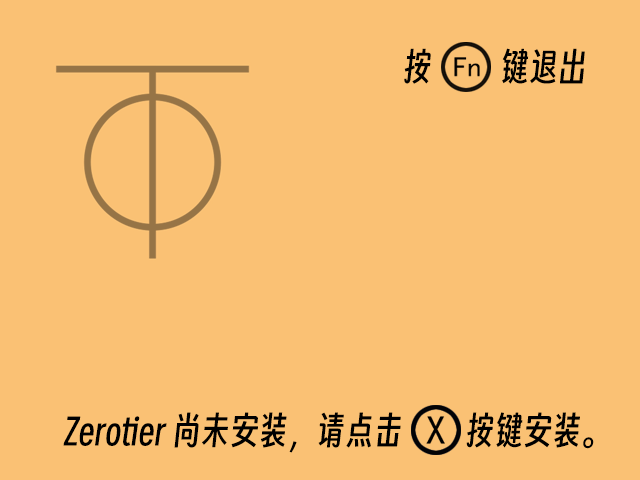
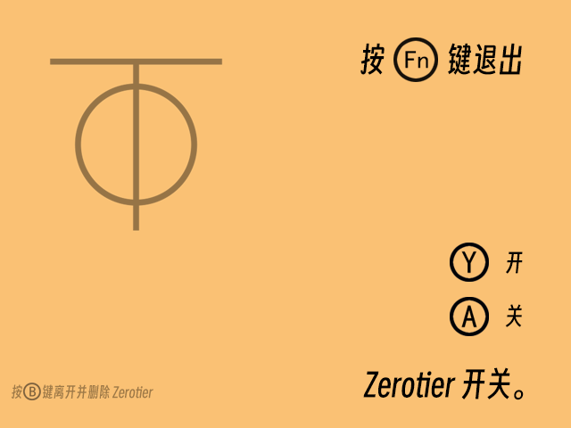

# RG35xx-P-RG35xx-H-Zerotier-Enable

本项目用于在安伯尼克(Anbernic) RG35xx H 的原厂系统和[MOD](https://github.com/cbepx-me/RG35xx-P-RG35xx-H-Modification)系统中添加 Zerotier 服务，并可以控制打开或关闭 Zerotier 服务的应用程序。

*注：本项目理论上同时支持 RG35xx-H 和 RG35xx-Plus，但未在 RG35xx-Plus 上测试。*

## 写在前面

首先，你需要了解什么是 Zerotier，Zerotier 是一个远程组建局域网的解决方案，而且它是跨平台的，不仅可以在 Windows、MacOS、iOS、Android，也可以在 Linux 上安装运行。

而开源掌机也多数是以 Linux 核心作为基础进行开发、发布的；周哥的 Anbernic 35xx 系列同样也是基于 Linux 内核的 Ubuntu 进行扩展开发的。

## 版本说明

分为 `RG35xxH` 和 `RG35xxH-MOD` 两个版本，使用方式基本相同。

- `RG35xxH`：支持 Anbernic 原生系统，可在原生系统开启 Zerotier 服务。该版本仅支持中文。
- `RG35xxH-MOD`：需要在原生系统中安装[Stock OS MOD](https://github.com/cbepx-me/RG35xx-P-RG35xx-H-Modification)，之后才能运行。该版本支持中、日、英 3 种语言。

## 使用方法

## 1. 拥有自己的 Zerotier 网络

访问 [Zerotier](https://www.zerotier.com/) 点击 `Sign Up`注册自己 Zerotier 账号。

注册登录后，显示如下界面点击`Create A Network`这样你就拥有了自己的 Zerotier 网络。

## 2. 下载程序代码并运行它

1. 根据系统版本选择并下载本项目中的 [RG35xxH](https://github.com/aclyyx/RG35xx-P-RG35xx-H-Zerotier-Enable/tree/main/RG35xxH) 或  [RG35xxH-MOD](https://github.com/aclyyx/RG35xx-P-RG35xx-H-Zerotier-Enable/tree/main/RG35xxH-MOD) 文件夹中的内容；

2. 编辑 `zt-network-id.txt`文件，将 Zerotier 的`网络ID`(`NETWORK ID`)写在里面并保存；

3. 将下载的文件及文件夹拷贝到 TF1 或 TF2 存储卡的 `/Roms/APPS`文件夹中；

4. 插卡开机；

5. 在用户界面选择`APPS`->`APPS`->选择对应的存储卡->`Zerotier`并运行；

6. 根据界面提示进行操作；

   

   

7. 如果是第一次加入 Zerotier 网络，需要登录 Zerotier 官网，在 Zerotier 网络的`Members`选项卡中允许连入；

8. 在`离开并删除 Zerotier`后，再次安装 Zerotier 同样需要登录 Zerotier 官网，在 Zerotier 网络的`Members`选项卡中允许连入。

