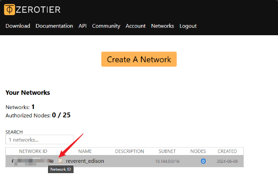

# RG35xx-P-RG35xx-H-Zerotier-Enable

本项目用于在安伯尼克(Anbernic) RG35xx H 的原厂系统中添加 Zerotier(ZT) 服务，并可以控制打开或关闭 ZT 服务的应用程序。

__注：__本项目理论上同时支持 RG35xx-H 和 RG35xx-Plus，但未在RG35xx-Plus上测试。

# 写在前面

首先，你需要了解什么是 Zerotier(ZT)，ZT是一个远程组件局域网的解决方案，而且它是跨平台的，不仅可以在 Windows、MacOS、iOS、Android，也可以在 Linux 上安装运行。

而开源掌机也多数是以 Linux 核心作为基础进行开发、发布的；周哥的 Anbernic 35xx 系列同样也是基于 Linux 内核的 Ubuntu 进行扩展开发的。

## 使用方法

## 拥有自己的 Zerotier 网络

访问 [Zerotier](https://www.zerotier.com/) 点击 `Sign Up`注册自己 ZT 账号。

注册登录后，显示如下界面点击`Create A Network`这样你就拥有了自己的 ZT 网络。

## 下载程序代码并运行它

1. 下载本项目中的 [RG35xxH](https://github.com/aclyyx/RG35xx-P-RG35xx-H-Zerotier-Enable/tree/main/RG35xxH) 文件夹里的内容；
2. 编辑 `RG35xxH` 文件夹中的 `zt-network-id.txt`文件，将 Zerotier 的`网络ID`(`NETWORK ID`)写在里面并保存；
3. 将下载的文件及文件夹拷贝到 TF1 或 TF2 存储卡的 `/Roms/APPS`文件夹中；
4. 插卡开机；
5. 在用户界面选择`APPS`->`APPS`->选择对应的存储卡->`Zerotier-已关闭`并运行；
6. 等待运行完成即可。
7. 如果是第一次加入 ZT 网络，需要登录 Zerotier 官网，在 ZT 网络的`Members`选项卡中允许连入。

